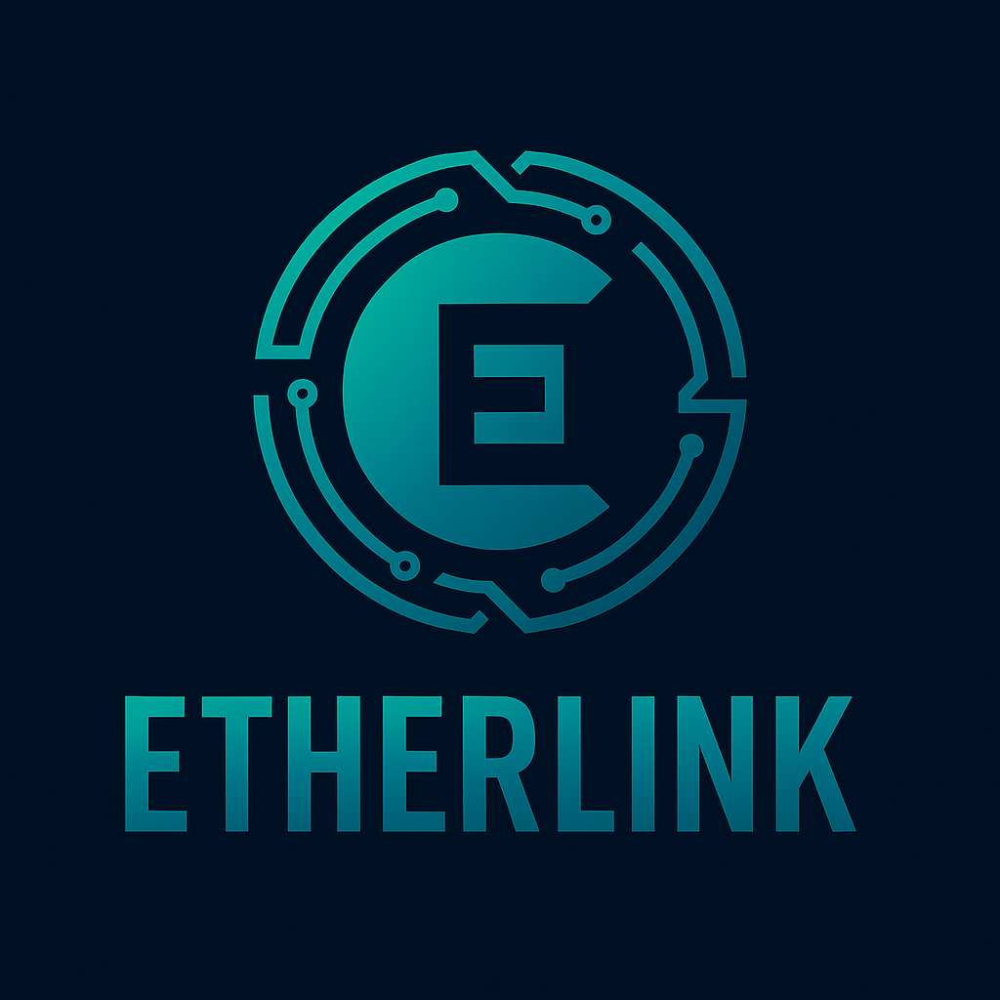

<div align="center">
  

# Etherlink

**A Rust-native bridge and gRPC client powering GhostChain’s hybrid Rust ↔ Zig ecosystem.**


</div>

---

## 🌉 Overview

**Etherlink** is the secure and performant **Rust ↔ Zig bridge layer** for the GhostChain ecosystem.  
It provides a **Rust gRPC client** and **FFI abstraction** that allows Rust-based services (GhostChain Core, GhostWallet, GhostBridge) to safely interoperate with Zig-based execution layers like **GhostPlane**.

Etherlink ensures **safe memory boundaries**, **async communication**, and **cross-language consistency** for blockchain and virtual machine execution.

---

## 🏗️ Architecture

```text
┌──────────────┐   gRPC/QUIC   ┌──────────────┐   Rust FFI   ┌─────────────┐
│   CNS (Zig)  │──────────────▶│  Etherlink   │────────────▶ │ GhostChain  │
│   GhostPlane │   Execution   │  (Rust)      │   Safe API   │  Core + gwallet
└──────────────┘               └──────────────┘              └─────────────┘
                                        │
                                        ▼
                                   RVM / rEVM
                              (Rust VMs & Execution)

🔑 Core Responsibilities
🦀 Rust-Side (Etherlink)

gRPC/QUIC client to communicate with GhostChain Core (ghostd)

Safe Rust APIs for transaction submission, state queries, and contract calls

Async wrappers for Zig-based GhostPlane execution

Integration with RVM/rEVM for contract execution

⚡ Zig-Side (GhostPlane)

High-performance L2 execution engine in Zig

Stateless settlement and ultra-fast contract execution

Communicates with Etherlink via gRPC and FFI hooks

🔒 Safety Guarantees

FFI Boundary Management: Rust owns types and memory, Zig only receives safe handles

Zero-Trust Defaults: All cross-language calls validated

Async + QUIC: Reliable, multiplexed communication channels


🔗 Integration Targets

Etherlink plugs directly into the GhostChain Core ecosystem:

ghostd — Node daemon (consensus, networking, state)

gwallet — Wallet daemon for accounts, signing, transactions

rvm — Rust Virtual Machine (native bytecode execution)

revm — Rust Ethereum VM compatibility module

ghostplane — Zig-based L2 execution engine

cns — Cryptographic Name Service (replaces ZNS)

🚀 Features

✅ Rust gRPC client with QUIC/HTTP3 transport

✅ Zig FFI bridge with safe abstractions

✅ Cross-runtime execution (Rust VMs + Zig GhostPlane)

✅ Unified crypto stack via gcrypt

✅ Async APIs for transactions, queries, and contract calls

✅ Secure by default — TLS enforced, zero-copy buffers

📦 Repository Layout
etherlink/
├── Cargo.toml          # Rust workspace config
├── src/
│   ├── client.rs       # gRPC/QUIC client
│   ├── ffi.rs          # Zig FFI layer
│   ├── ghostplane.rs   # GhostPlane abstractions
│   ├── rvm.rs          # RVM integration
│   ├── revm.rs         # rEVM integration
│   └── cns.rs          # Cryptographic Name Service hooks
├── proto/              # gRPC .proto files
├── examples/           # Usage demos
├── tests/              # Integration + property tests
└── docs/               # Architecture and specs

🧭 Roadmap

 gRPC client for GhostChain Core

 QUIC multiplexing layer (replace legacy DERP/WebSocket)

 FFI bindings to GhostPlane (Zig)

 Safe async execution wrappers

 RVM/rEVM integration

 CNS (Cryptographic Name Service) support

 End-to-end integration test suite

✨ Etherlink — Bridging Ghosts and Machines, Rust and Zig.
